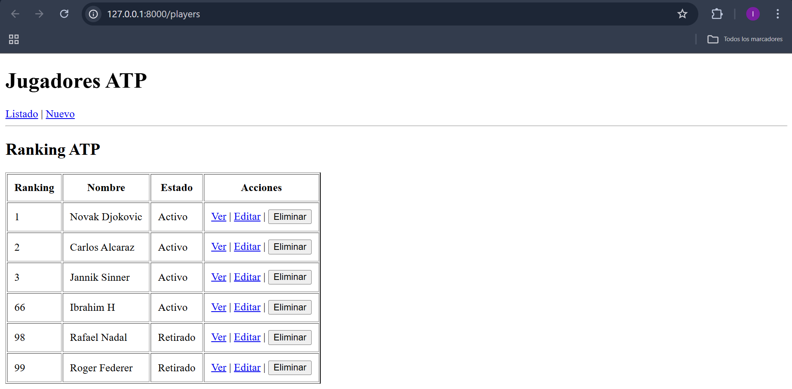
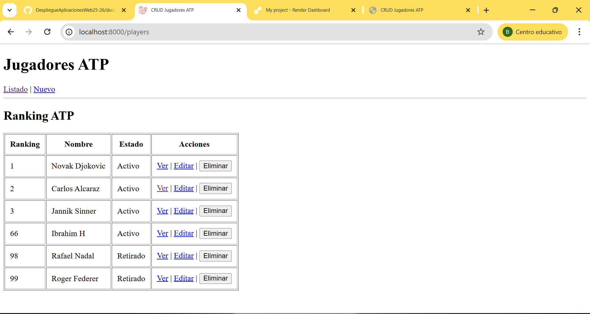
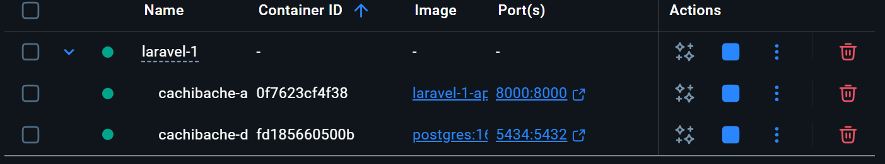
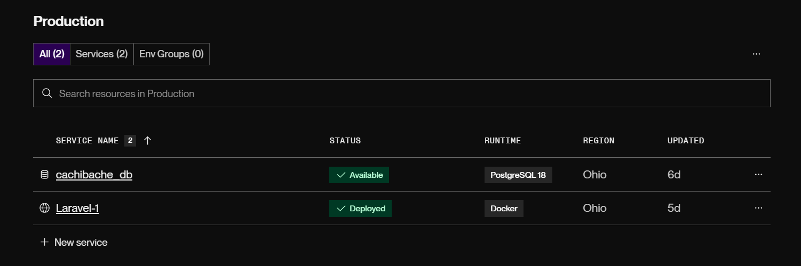
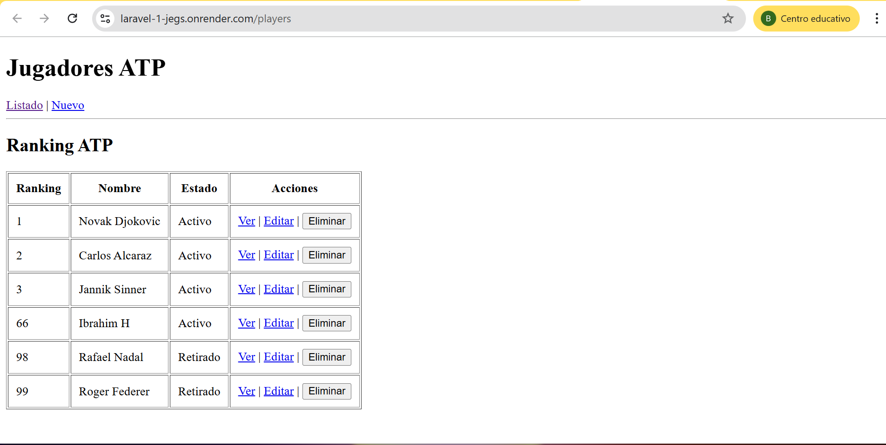

# Informe de Despliegue de Entornos - Proyecto Cachibache

## 1. Entorno LOCAL (Nativo)

Es el entorno de desarrollo inmediato ejecutado sobre el sistema operativo base sin virtualización.

* **Servidor:** PHP 8.2 integrado.
* **Comando:** `php artisan serve`.
* **Uso:** Pruebas rápidas de lógica y rutas.

> ### 📸 CAPTURA 1: Terminal ejecutando 'php artisan serve'
>
> 

---

## 2. Entorno DEV (Docker)

[cite_start]Entorno que emula las condiciones de un servidor real utilizando contenedores.

* [cite_start]**Configuración:** Basada en el archivo `docker-compose.dev.yml`[cite: 2].
* [cite_start]**Base de Datos:** Contenedor de PostgreSQL 16 independiente con puerto mapeado `5434`[cite: 2].
* [cite_start]**Variables de Entorno:** Utiliza `DB_HOST=db` para la comunicación interna entre servicios[cite: 2].

> ### 📸 CAPTURA 2: Contenedores en ejecución (Docker PS)
>
> 
> 

---

## 3. Entorno RENDER (Producción Cloud)

Despliegue real en la nube, gestionado mediante el `Dockerfile` y conectado a una base de datos administrada.

* [cite_start]**Servicio Web:** `Laravel-1` desplegado mediante Docker.
* [cite_start]**Base de Datos:** `cachibache_db` (PostgreSQL).
* [cite_start]**Automatización:** El comando `CMD` realiza la migración forzada de la base de datos y lanza el servidor en el puerto dinámico `$PORT`.

> ### 📸 CAPTURA 3: Panel de control de Render
>
> 
> 

---